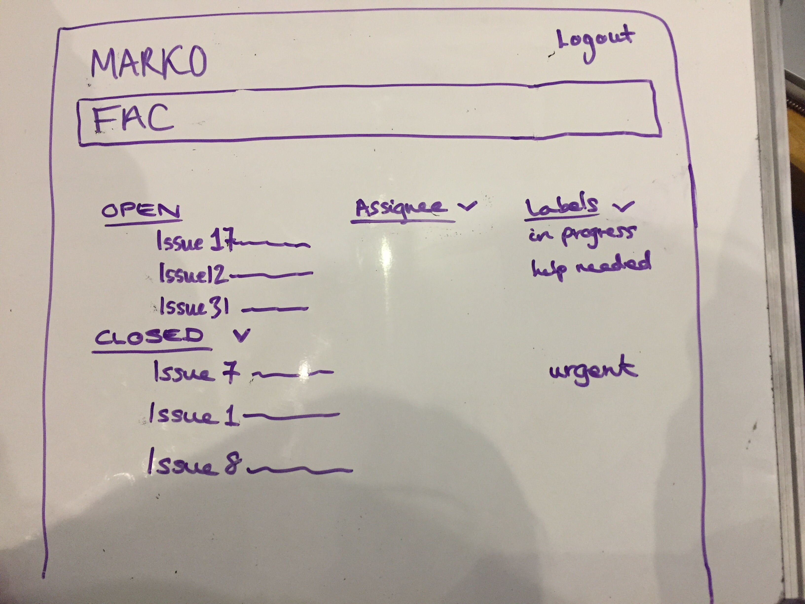

# Seal of approval

A website for FAC members to see all the issues from the FAC organisation on github.

# Setup
- Clone our repo
- Do ```npm install ``` followed by ```npm start```
- Request our environment variables from us and put them into a config.env
- Go to localhost:8080

# Tests
- To run our tests do ```npm test```

## Design Mockup



## User stories

**As a** FAC student,
**I want to** see the status of all my issues from the FAC organisation in one place
**so that** I can decide which to tackle first i.e. priority

Features:
  - login via Github (OAuth) for a personalised homepage
  - list issues open & assigned to me, including their labels
  - issues are clickable, to navigate to github & start working
  - list of my closed issues (collapse-able)
  - access my github profile from the website - click on "Marko"
  - filter by assignee
  - filter by label

Stretch goal:
- sort issue list by label e.g. high priority at the top
- user can assign themselves via our website, rather than having to navigate to github first
